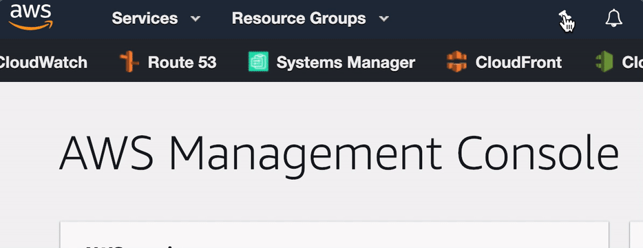
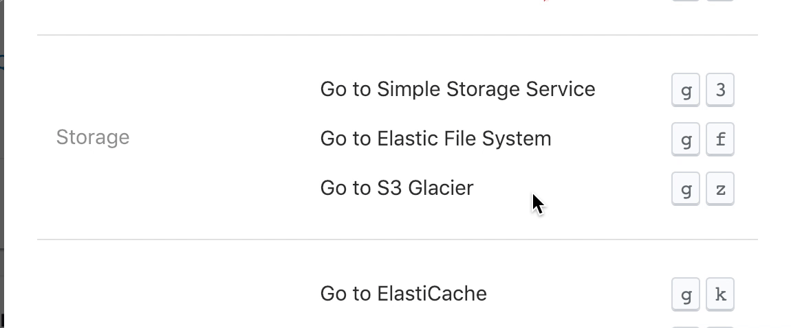
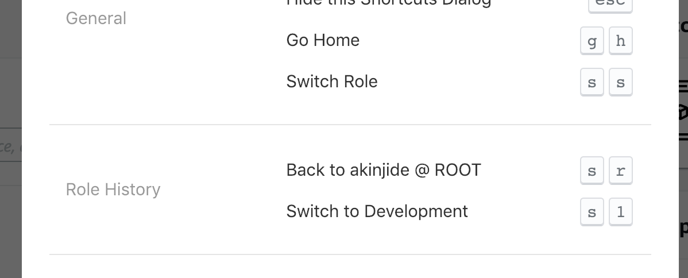
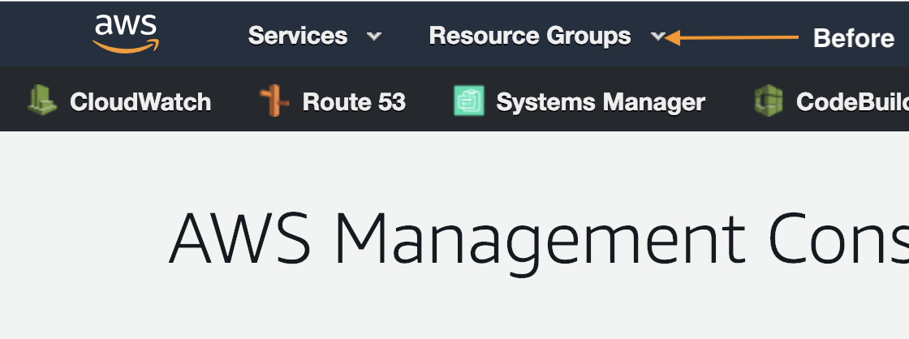
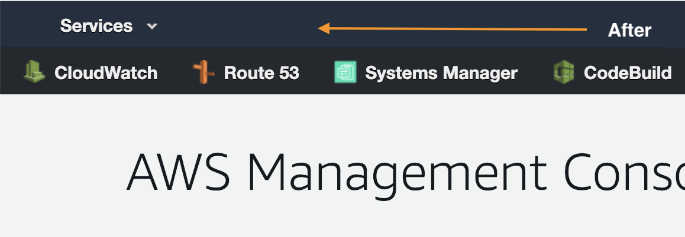

#  Refined AWS Console

Simplifies the Amazon Web Services Console interface.

## Install

- **Chrome** extension

## Highlights

<table>
  <tr>
    <th width="50%">
      Pin More! Do More! 
      <em>(Quick navigation appears below header)</em>
    </th>
    <th width="50%">
      Reduce navigation to services tab with shortcuts 
      <em>(Just press ?)</em>
    </th>
  </tr>
  <tr><!-- Prevent zebra stripes --></tr>
  <tr>
    <td>
      
    </td>
    <td>
      
    </td>
  </tr>
</table>

<table>
  <tr>
    <th width="50%">
      Switch between assigned Roles 
    </th>
    <th width="50%">
      Remove unused navigation menus 
    </th>
  </tr>
  <tr><!-- Prevent zebra stripes --></tr>
  <tr>
    <td>
      
    </td>
    <td>
      
      
    </td>
  </tr>
</table>

## Keyboard Shortcuts

| Category      | Shortcut               | Description                                           |
| :------------ |:-----------------------|:------------------------------------------------------|
| General       | `?`                    | Show Shortcuts Dialog                                 |
|               | `esc`                  | Hide Shortcuts Dialog                                 |
|               | `g` + `h`              | Go Home                                               |
|&nbsp;         |                        |                                                       |
| Services      | `g` + **numeric**      | Go to AWS service with numeric character (i.e. `2`)   |
|               | `g` + **alphabet**     | Go to AWS service with alphabet character (i.e. `a`)  |
|&nbsp;         |                        |                                                       |
| Role History  | `s` + `r`              | Switch to Root role                                   |
|               | `s` + **numeric**      | Switch with numeric character (i.e. `2`) to role      |
