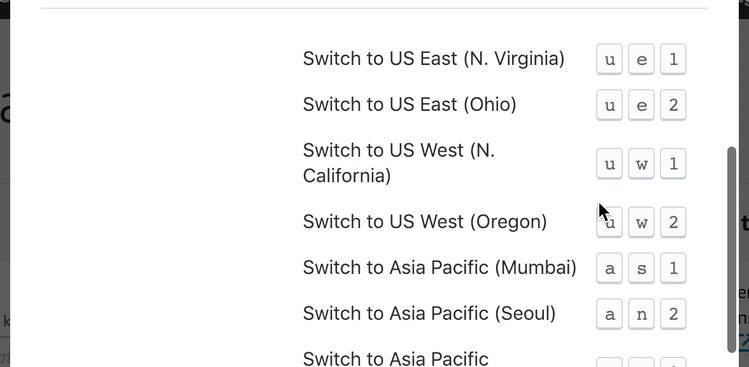
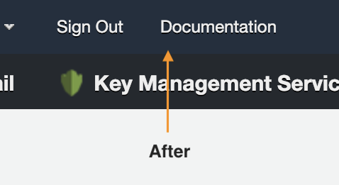

#  Refined AWS Console

Simplifies the Amazon Web Services Console interface.

## Install

- [**Chrome** extension](https://chrome.google.com/webstore/detail/refined-aws-console/ockddcaogdonfmcfhdblbflchnjgiilc)
- [**Firefox** extension](https://addons.mozilla.org/en-US/firefox/addon/refined-aws-console/)

## Highlights

<table>
  <tr>
    <th width="50%">
      Pin More! Do More! 
      <em>(Quick navigation appears below header)</em>
    </th>
    <th width="50%">
      Reduce navigation to services tab with shortcuts 
      <em>(Just press ?)</em>
    </th>
  </tr>
  <tr><!-- Prevent zebra stripes --></tr>
  <tr>
    <td>
      
    </td>
    <td>
      
    </td>
  </tr>
</table>

<table>
  <tr>
    <th width="50%">
      Switch between assigned roles 
    </th>
    <th width="50%">
      Switch between AWS available regions 
    </th>
  </tr>
  <tr><!-- Prevent zebra stripes --></tr>
  <tr>
    <td>
      
    </td>
    <td>
      
    </td>
  </tr>
</table>

<table>
  <tr>
    <th width="50%">
      Show custom navigation menus 
      <em>(Documentation, Sign Out and more)</em>
    </th>
    <th width="50%">
      Hide unused navigation menus 
    </th>
  </tr>
  <tr><!-- Prevent zebra stripes --></tr>
  <tr>
    <td>
      
      
    </td>
    <td>
      
      
    </td>
  </tr>
</table>

## Keyboard Shortcuts

| Category      | Shortcut                                    | Description                                           |
| :------------ |:--------------------------------------------|:------------------------------------------------------|
| General       | `?`                                         | Show Shortcuts Dialog                                 |
|               | `esc`                                       | Hide Shortcuts Dialog                                 |
|               | `g` + `h` + `o`                             | Go Home                                               |
|&nbsp;         |                                             |                                                       |
| Services      | `g` + (**numeric**, **alphabet**) * 2       | Go to AWS service with numeric character (i.e. `2`)   |
|               |                                             |                                                       |
|&nbsp;         |                                             |                                                       |
| Role History  | `s` + `r` + `r`                             | Switch to Root role                                   |
|               | `s` + `r` + **numeric**                     | Switch with numeric character (i.e. `2`) to role      |
|&nbsp;         |                                             |                                                       |
| Region        | `u` + `e` + `1`                             | Switch to us-east-1                                   |
|               | **each word at 0**                          | Switch with each word at `0` (i.e. `uw1 -> us-west-1`)|
