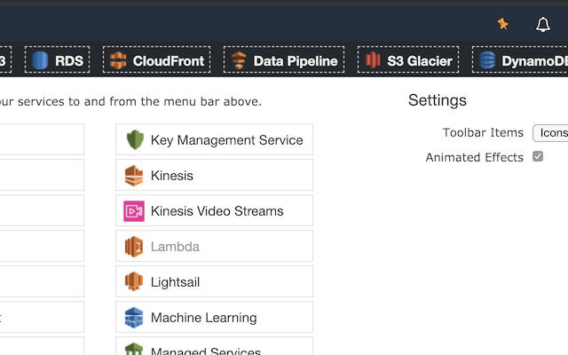

#  Refined AWS Console

Simplifies the Amazon Web Services Console interface.

## Keyboard Shortcuts

| Category      | Shortcut               | Description                                           |
| :------------ |:-----------------------|:------------------------------------------------------|
| General       | `?`                    | Show Shortcuts Dialog                                 |
|               | `esc`                  | Hide Shortcuts Dialog                                 |
|               | `g` + `h`              | Go Home                                               |
|&nbsp;         |                        |                                                       |
| Services      | `g` + **numeric**      | Go to AWS service with numeric character (i.e. `2`)   |
|               | `g` + **alphabet**     | Go to AWS service with alphabet character (i.e. `a`)  |
|&nbsp;         |                        |                                                       |
| Role History  | `s` + `r`              | Switch to Root role                                   |
|               | `s` + **numeric**      | Switch with numeric character (i.e. `2`) to role      |
